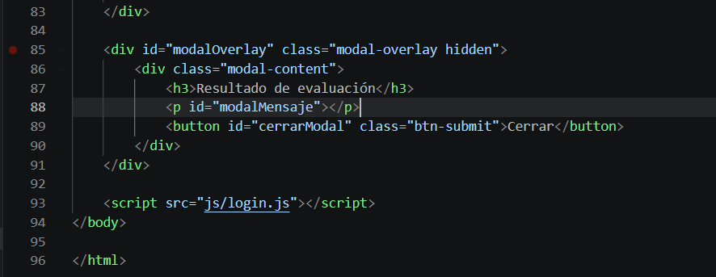

  <table style="width:100%; border:none; background-color:transparent;">
    <tr>
      <td style="width:20%; text-align:left; border:none;">
        
      </td>
      <td style="width:60%; text-align:center; border:none;">
        <h2>TECNOLÓGICO NACIONAL DE MÉXICO</h2>
        <h3>INSTITUTO TECNOLÓGICO DE OAXACA</h3>
      </td>
      <td style="width:20%; text-align:right; border:none;">
        
      </td>
    </tr>
  </table>
 

<b>CARRERA:</b>

  
INGENIERÍA EN SISTEMAS COMPUTACIONALES

 

<b>MATERIA:</b> PROGRAMACIÓN WEB

 

<b>PRESENTA:</b>

  
<b>MEIXUEIRO CRUZ ARTURO DANIEL</b>

  
<b>MACUIXTLE GAYTAN MIGUEL ANGEL</b>

 

<b>NOMBRE DEL CATEDRÁTICO:</b> MARTINEZ NIETO ADELINA

 

<b>ACTIVIDAD:</b> Sistema de Login y Dashboard con Validaciones

  

  
07 DE JULIO DEL 2026

# Sistema de Login y Captura de Alumnos

Este proyecto consiste en un sistema web con login, registro y un dashboard para la captura de información de alumnos, incluyendo validaciones en frontend.

## Explicación y Documentación

El proyecto utiliza CSS vanilla con variables de diseño inspiradas en YouTube (dark theme). No se emplea ningún framework CSS externo como Bootstrap.

**Flujo del sistema:**
- El usuario accede a `login.html` o `registro.html`.
- Tras autenticación exitosa (validaciones de correo y contraseña), se guarda el email en `sessionStorage` y redirige a `index.html`.
- En `index.html`, se recupera el usuario de sessionStorage y se muestra en el navbar.
- El sidebar permite navegar a la sección de Captura de Alumnos.
- El formulario de captura incluye validaciones para nombre, correo, contraseña, número de control (6 dígitos) y fecha de nacimiento.
- Al enviar, se calcula la edad y se muestra un modal indicando si el alumno es mayor o menor de edad.

**Métodos principales en `login.js`:**
- `validarCorreo()`, `validarPassword()`, `alfanumerico()`, `validarLongitud()`, `calcularEdad()`, `esMayorDeEdad()`, `validarFechaLogica()`, `capitalizarNombres()`.
- Manejo de eventos para formularios, blur validations y submit.
- Gestión de sesión con sessionStorage.

## Proceso de Creación

### 1. LOGIN
 
Codigo del login simple aun no funciona por que los js no han sido creados pero los referenciamos para ahorrar tiempo, lo mismo con los estilos

Pantalla del login funcionando en el navegador

Login sin nada 

### 2. CODE CSS LOGIN

Unicamente los inicios del css para el estilo del login para los colores y tipo de letra que usara

### 3. PANTALLA CON LOS LABELS

Codigo para los labels para poder poner las contraseñas y correo, aun sin funcion debido a que el js no esta hecho, todo esto pertenece a la fase de diseño

 
Labels en accion

### 4. ESTILOS PARA EL CSS

CSS básico.  

### 5. ESTILOS PARA LOS BOTONES Y LABELS

Codigo para los botones y labels para que tengan mas formato  

### 6. CREACION DEL JS PARA EL ACCESO

Code del js para para poder permitirnos el acceso pidiendo el usuario y contraseña para poder acceder al index (aun no esta hecho el index)

### 7. CREACION DE BOTON PARA CREAR CUENTA

Code con la metodologia para el boton para crear una cuenta que lleva a login html

### 8. CREACION DE LOS ESTILOS PARA EL CSS

Estilos incompletos.  

### 9. CREACION DE REGISTRO HTML

Code para registrar correos

### 10. CREACION DE LA METODOLOGIA EN EL JS

Metodologia en el js para el login 

### 11. CREACION DE LAS FUNCIONES PARA LAS VALIDACIONES
**Antes:**  
Validaciones simples.  

**Después:**  
Funciones completas para edad, control, etc.

**Modificaciones:** Lógica del modal y cálculos.

### 12. CREACION LAS SECCIONES EN EL SIDEBAR
**Antes:**  
Validaciones simples.  

**Después:**  
Funciones completas para edad, control, etc.

**Modificaciones:** Lógica del modal y cálculos.

### 13. CREACION LA SUBSECCION DE CAPTURA EN USUARIOS
**Antes:**  
Validaciones simples.  

**Después:**  
Funciones completas para edad, control, etc.

**Modificaciones:** Lógica del modal y cálculos.

### 14. CREACION DEL ESTILO PARA EL INDEX
**Antes:**  
Validaciones simples.  

**Después:**  
Funciones completas para edad, control, etc.

**Modificaciones:** Lógica del modal y cálculos.

### 15. CREACION ESTILO PARA EL SUBMENU
**Antes:**  
Validaciones simples.  

**Después:**  
Funciones completas para edad, control, etc.

**Modificaciones:** Lógica del modal y cálculos.

### 16. CREACION DEL ESTILO PARA EL FORMULARIO
Validaciones simples.  

**Después:**  
Funciones completas para edad, control, etc.

**Modificaciones:** Lógica del modal y cálculos.

### 17. CREACION DEL ESTILO PARA EL MODAL
**Antes:**  
Validaciones simples.  

**Después:**  
Funciones completas para edad, control, etc.

**Modificaciones:** Lógica del modal y cálculos.

### 18. CREACION DE LOS BOTONES DE LA SECCIONES
**Antes:**  
Validaciones simples.  

**Después:**  
Funciones completas para edad, control, etc.

**Modificaciones:** Lógica del modal y cálculos.

### 19. CREACION DE LAS CONSTANTES PARA LAS VALIDACIONES
**Antes:**  
Validaciones simples.  

**Después:**  
Funciones completas para edad, control, etc.

**Modificaciones:** Lógica del modal y cálculos.

### 20. CREACION DE LA LOGICA PARA LAS ALERTAS DE SPAN
**Antes:**  
Validaciones simples.  

**Después:**  
Funciones completas para edad, control, etc.

**Modificaciones:** Lógica del modal y cálculos.

### 21. CREACION DE LA FUNCION PARA VALIDAR LOS DATOS
**Antes:**  
Validaciones simples.  

**Después:**  
Funciones completas para edad, control, etc.

**Modificaciones:** Lógica del modal y cálculos.

### 22. CREACION DE  LA METODOLOGIA DEL MODAL
**Antes:**  
Validaciones simples.  

**Después:**  
Funciones completas para edad, control, etc.

**Modificaciones:** Lógica del modal y cálculos.

### 22. CREACION DEL MODAL EN EL INDEX
**Antes:**  
Validaciones simples.  

**Después:**  
Funciones completas para edad, control, etc.

**Modificaciones:** Lógica del modal y cálculos.